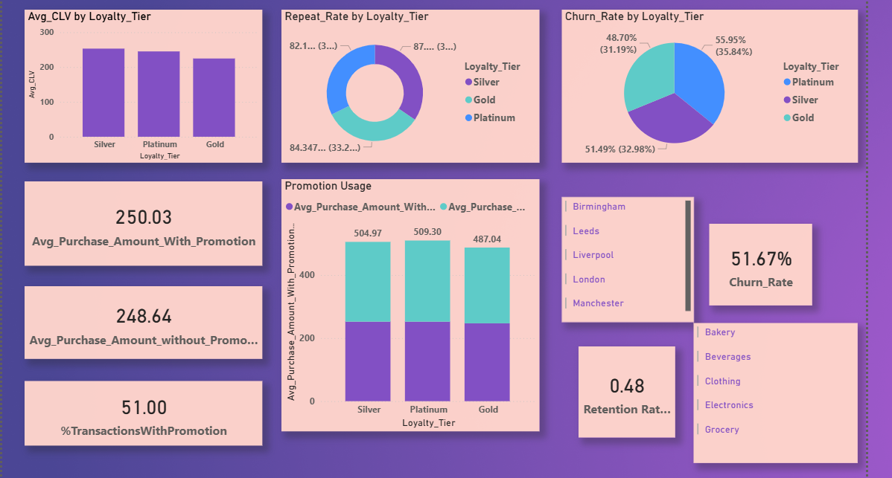
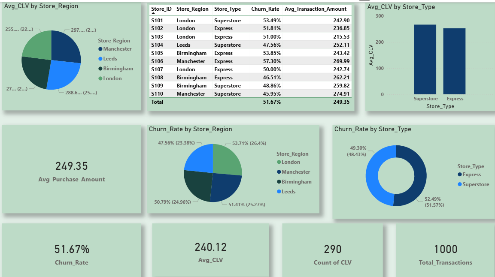

# 📊 Customer Retention Analysis Dashboard

## 🚀 Project Summary
This project analyzes customer data to identify churn patterns and improve retention strategies using Power BI. The dashboard highlights key metrics, customer segments, and behavioral trends to support data-driven decision-making.

---

## 📊 Problem Statement
Customer churn significantly impacts business revenue and growth. This project aims to identify customers at risk of leaving and provide insights to improve retention strategies.

---

## 🎯 Objective
- Analyze customer behavior and engagement patterns  
- Identify key factors influencing churn  
- Provide actionable insights to improve retention  

---

## 🛠 Tools & Technologies
- Power BI  
- Power Query  
- DAX (Data Analysis Expressions)  

---

## 📂 Dataset
The dataset includes:
- Customer demographics  
- Transaction/activity data  
- Engagement and behavioral metrics  

---

## 📊 Analytical Approach
- Data cleaning and transformation using Power Query  
- Data modeling and relationship building  
- KPI creation using DAX  
- Customer segmentation and churn analysis  

---

## 📈 KPIs Analyzed
- Churn Rate  
- Retention Rate  
- Customer Lifetime Value (CLV)  
- Active vs Inactive Customers  

---

## 📷 Dashboard Preview

---

## 🧠 Insights & Recommendations

### 🔍 Key Insights
- Customers with **low engagement** show higher churn probability  
- Customers with **short tenure (< 6 months)** are more likely to churn  
- A small segment contributes disproportionately to overall churn  
- Increased interaction strongly correlates with higher retention  

### 💡 Business Recommendations
- Target high-risk customers with personalized campaigns  
- Improve onboarding experience for new customers  
- Increase engagement through offers and communication  
- Continuously monitor retention KPIs  

---

## 📊 Dashboard Explanation
The dashboard provides:
- Churn distribution across customer segments  
- Retention trends over time  
- Key metrics influencing customer behavior  

---

## 📂 Project Structure
[Customer_Demographics.csv](https://github.com/user-attachments/files/27366726/Customer_Demographics.csv)[Store_Locations.csv](https://github.com/user-attachments/files/27366733/Store_Locations.csv)
[Loyalty_Program.csv](https://github.com/user-attachments/files/27366729/Loyalty_Program.csv)
[Customer_Transactions.csv](https://github.com/user-attachments/files/27366727/Customer_Transactions.csv)
[Churn_Labelled_Customers.csv](https://github.com/user-attachments/files/27366722/Churn_Labelled_Customers.csv)

---

## 🎯 Conclusion
This project demonstrates how data-driven insights can help businesses identify churn risks early and implement targeted strategies to improve customer retention and profitability.

---

## 🔮 Future Improvements
- Apply machine learning models for churn prediction  
- Add real-time data integration  
- Enhance dashboard with advanced drill-down analysis  

---

## 📬 Contact
Feel free to connect for feedback or collaboration.
